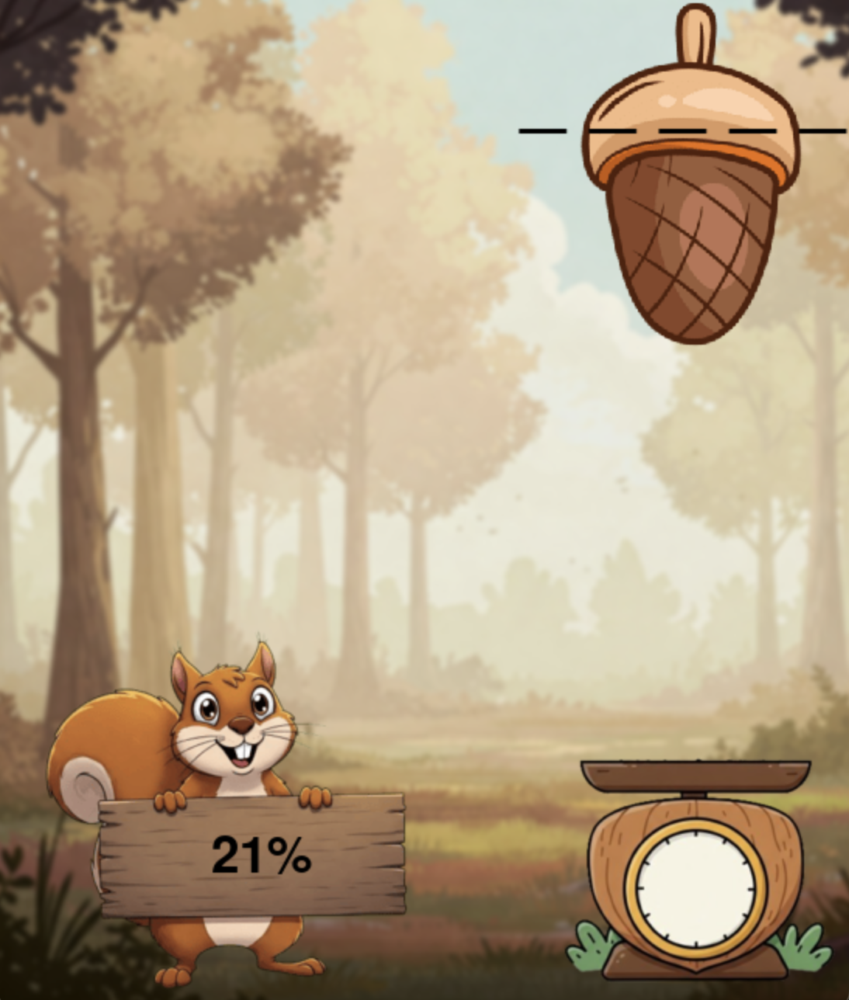
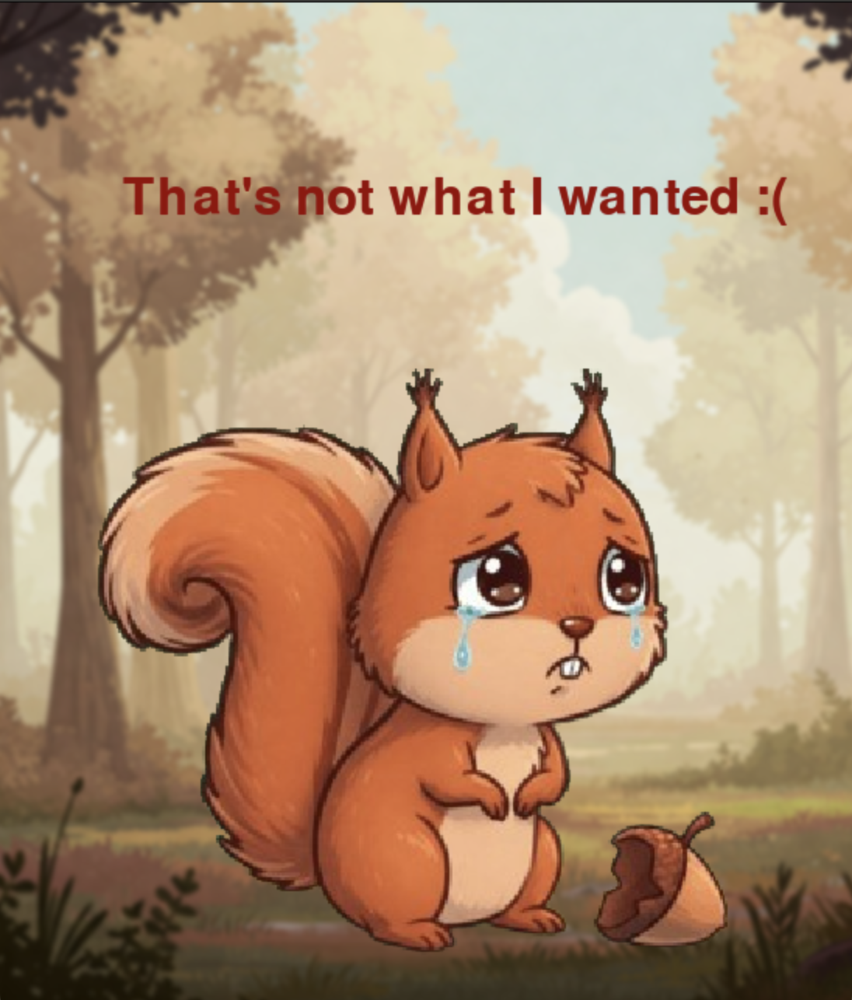
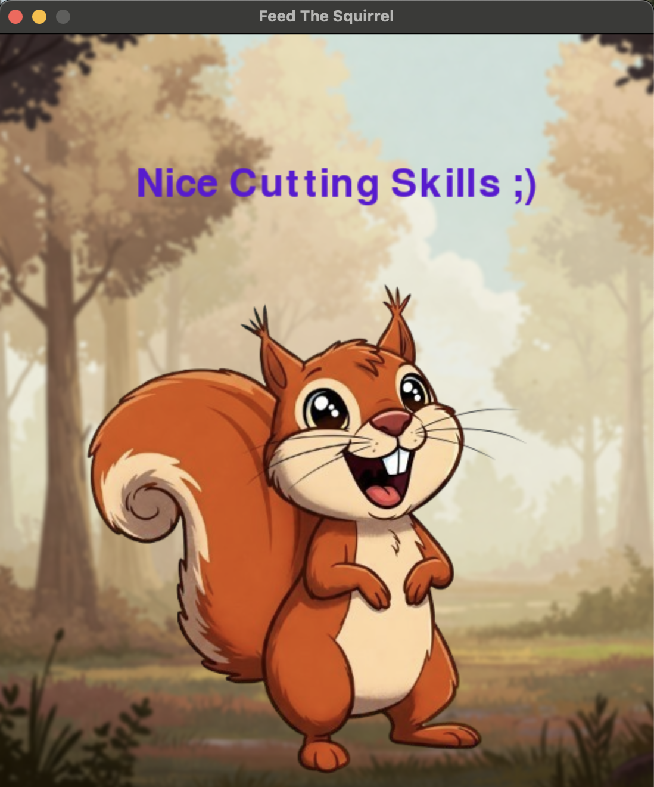

# Feed-The-Squirrel 🐿️
A fun little Python mini-game (made with Pygame) where you try to cut a nut exactly how the squirrel wants it! 🎯

&nbsp;&nbsp;&nbsp;

## 🎮 How to Play
1. The squirrel will ask for a specific percentage of the nut.
2. Use the **spacebar** to cut the nut when the cutter is at the right spot.
3. The cut piece will fall onto a measuring scale.
4. If your cut is close enough to what the squirrel wanted — you win! Otherwise... well, sad squirrel 🐿️💔
5. Hit enter to start a new game. Have Fun! 😁

&nbsp;&nbsp;&nbsp;

## 📸 Screenshots

  
  
  

&nbsp;&nbsp;&nbsp;

## 🛠️ Built With
- Python
- Pygame

&nbsp;&nbsp;&nbsp;

### Prerequisites
Make sure you have Python and Pygame installed for this to work!

&nbsp;&nbsp;&nbsp;

### Citations
All Images in this program were generated using Google's Gemini

